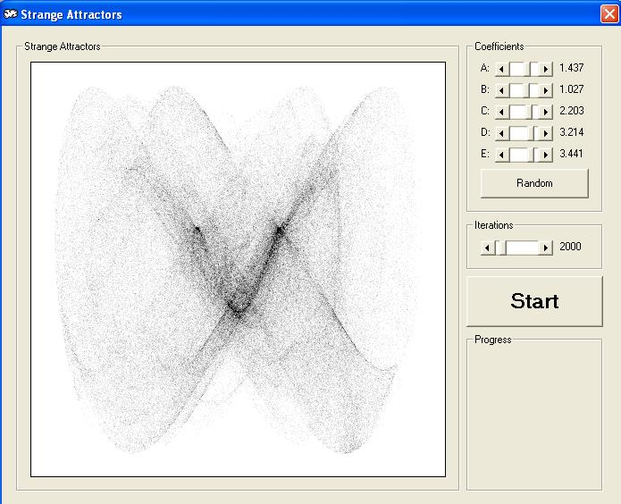



## Strange Attractors

### Description

A simplistic definition of a strange attractor is "A strange attractor is simply the pattern of the pathway, in visual form, produced by graphing the behaviour of a system." Just check out the code.
 
### More Info
 

             |
---                |---
**Submitted On**   |2004-06-16 15:55:14
**By**             |[SixLetter](https://github.com/Planet-Source-Code/PSCIndex/blob/master/ByAuthor/sixletter.md)
**Level**          |Intermediate
**User Rating**    |5.0 (20 globes from 4 users)
**Compatibility**  |VB 6\.0
**Category**       |[Miscellaneous](https://github.com/Planet-Source-Code/PSCIndex/blob/master/ByCategory/miscellaneous__1-1.md)
**World**          |[Visual Basic](https://github.com/Planet-Source-Code/PSCIndex/blob/master/ByWorld/visual-basic.md)
**Archive File**   |[Strange\_At1758006162004\.zip](https://github.com/Planet-Source-Code/sixletter-strange-attractors__1-54424/archive/master.zip)

